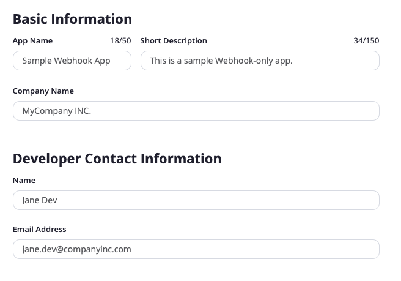
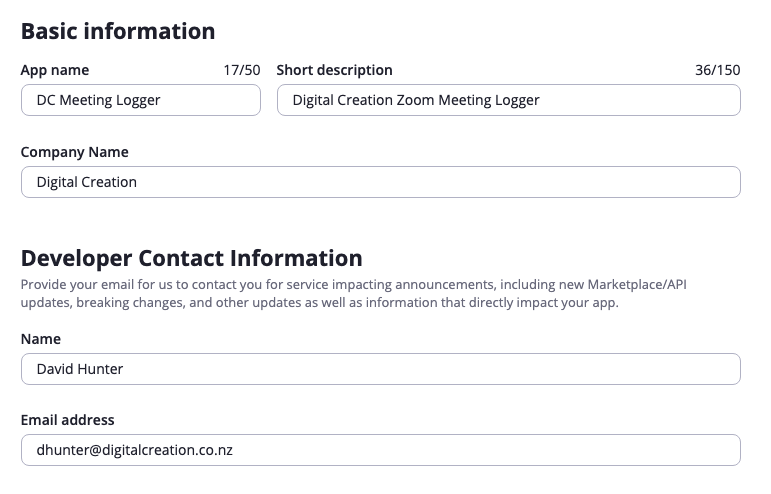
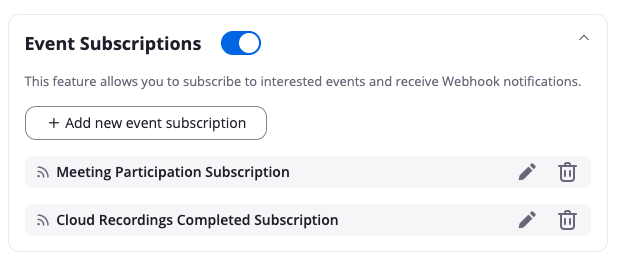
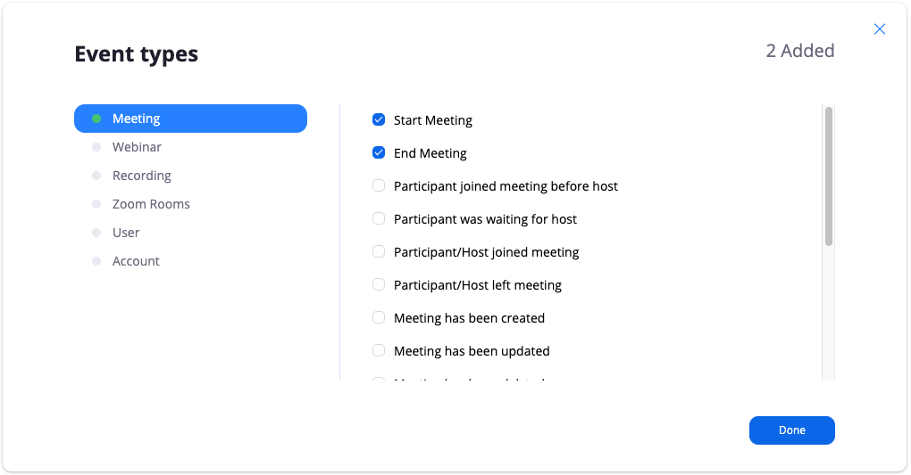
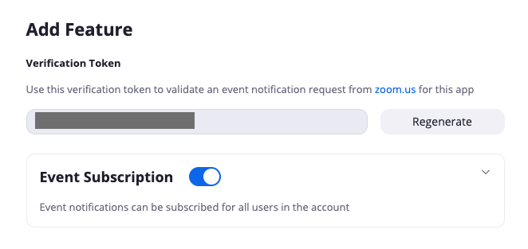
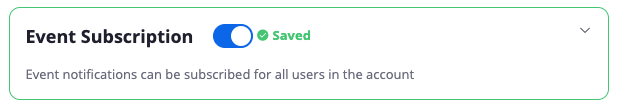
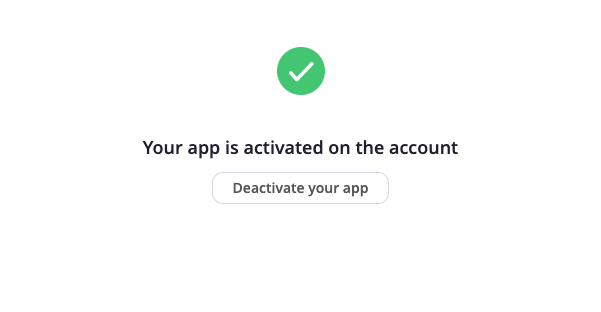

# setups

[Zoom - Webhooks](#zoom)

[Google - App](#google)

## <a name="zoom">Zoom - Webhooks</a>

<a>https://marketplace.zoom.us/docs/api-reference/webhook-reference</a>

<a>https://marketplace.zoom.us/docs/guides/build/webhook-only-app</a>

## Register Your App

To register your app, visit the <a>https://marketplace.zoom.us/</a>

Click on the Develop option in the dropdown on the top-right corner.

Select Build App. A page with various app types will be displayed.

Select Webhook Only as the app type and click on Create.

## Provide App Information

The windows that follow will ask you to provide a series of information. All fields are required unless otherwise noted. Descriptions of each field are provided below:

App Name: dc-zoom-meeting-logger

Information: In this page, you must provide some basic information about your app including a short description about your app, your company’s name and your contact information.

## Set App Features

When registering your webhook-only app, you can choose which events you would like to receive payloads for,  
by enabling <a href="https://marketplace.zoom.us/api-reference/webhook-reference">Event Subscription</a> features.  
Event Subscriptions are the core features of a webhook app using which, your app can listen to an event in your Zoom account. 
In many cases, event subscriptions can replace the need for repeated API calls.

To create an Event Subscription, click the toggle on.  
Click + Add new event subscription.  
Choose an optional Subscription Name, and add an Event Notification Endpoint URL for both development and production.  
These URLs will receive POST requests containing data on the notification for each subscribed event.  
Note: Event Notification Endpoint URLs must be secured over HTTPS.
  
Note: Event Subscription names have no effect on the payload of the request.  
  
Add the event types for this Event Subscription and click Save.  
  
To add additional Event Subscriptions, click + Add new event subscription again.  
  
Although you can subscribe to as many events as needed for each event subscription, you can only have a maximum of ten event subscriptions per app.  
  
Event subscriptions can have duplicate Events. For example, one Event Subscription could have Meetings and User Events, and a second Event Subscription can have Meetings and Recordings events.  

Choose Event Subscriptions to match the needs of your app. For example, you might want to add a feature in your app that sends an automated notification to your app every time a user on your account starts or ends a meeting. To set this up, you must subscribe to Start Meeting and End Meeting events listed under the Meeting event type.

A verification token will be generated in the Feature page after you enable and save the event subscription. This token can be used to validate the POST requests that are sent by Zoom to your event notification endpoint URL.

Under ‘Event types,’ click Add events. Choose events for which you would like to receive notification for and click Done. Next, click Save.

## Activation

After providing all the details mentioned in the steps above, your app will be activated and you will start receiving notifications in your endpoint URL for events that you have subscribed to.

## <a name="google">Google - App</a>